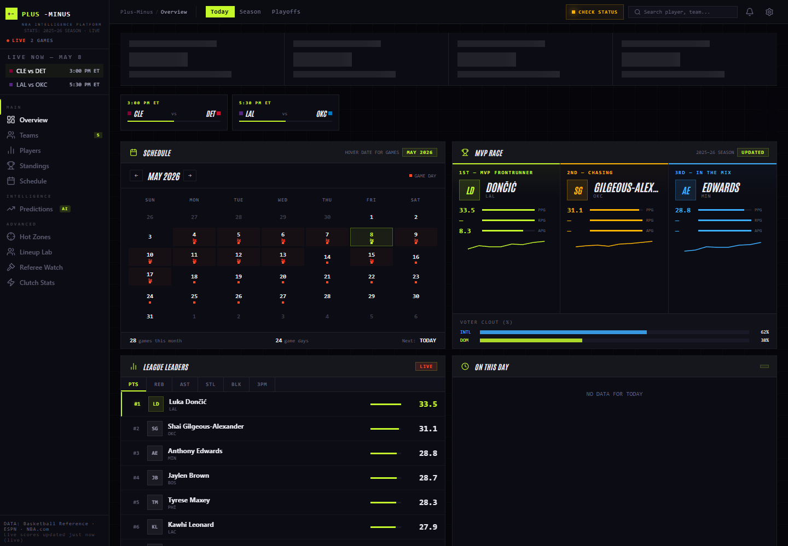

# Plus-Minus

Plus-Minus is an NBA intelligence platform: live scoreboard and schedule data, standings, leaders, model-backed game predictions, and Groq-powered analysis.



## Project Structure

```text
apps/
  api/      FastAPI prediction service, model artifacts, data pipeline
  web/      Static dashboard, Cloudflare Worker, local dev proxy
docs/       Setup, architecture, and data-quality notes
scripts/    Local quality and verification scripts
```

This layout keeps product code, backend code, documentation, and developer tooling separated in a way that is easy to scan in a portfolio review.

## Quick Check

```powershell
.\check.ps1
.\test.ps1
```

API tests require the backend dependencies:

```powershell
python -m pip install -r .\apps\api\requirements.txt -r .\apps\api\requirements-dev.txt
```

If PowerShell blocks local scripts:

```powershell
powershell -ExecutionPolicy Bypass -File .\check.ps1
```

For a syntax/config-only check when backend dependencies are not installed yet:

```powershell
powershell -ExecutionPolicy Bypass -File .\check.ps1 -SkipBackendImport
```

## Run Locally

Full stack:

```powershell
.\dev.ps1
```

Or run each side manually.

Backend:

```powershell
cd .\apps\api
python -m venv .venv
.\.venv\Scripts\Activate.ps1
pip install -r requirements.txt
uvicorn main:app --reload --port 8000
```

Frontend:

```powershell
node .\scripts\static-server.mjs .\apps\web 8080
```

Open `http://localhost:8080/pages/home.html`.

## Data Reliability

- Live scores use NBA CDN first, ESPN fallback, and stale cache only as a last resort.
- Scoreboard and slate dates are keyed to `America/New_York`, matching the NBA game-day calendar.
- The dashboard keeps source/freshness metadata so users can tell whether data is live, cached, or stale.
- Prediction routes resolve to local FastAPI during local dev and the Cloudflare Worker in production.

## Key Docs

- [Architecture](docs/architecture.md)
- [Data Quality](docs/data-quality.md)
- [Model Card](docs/model-card.md)
- [Setup](docs/setup.md)

## Quality Bar

- GitHub Actions workflow in `.github/workflows/ci.yml`.
- Web tests use Node's built-in test runner.
- API tests use `pytest`.
- Model training writes `apps/api/model_metrics.json` with time-series accuracy, log loss, and Brier score.
- UI exposes a system-status drawer for Worker, backend, scoreboard, and schedule freshness.
- Motion layer lives in `apps/web/styles/motion.css` and respects `prefers-reduced-motion`.

## Secrets

The real Groq key belongs in `apps/api/.env` for local backend development and in Cloudflare Worker secrets for production. Commit `.env.example`, not `.env`.
